# Image Super-Resolution with Text Prompt Diffusion

[Zheng Chen](https://zhengchen1999.github.io/), [Yulun Zhang](http://yulunzhang.com/), [Jinjin Gu](https://www.jasongt.com/), [Xin Yuan](https://en.westlake.edu.cn/faculty/xin-yuan.html), [Linghe Kong](https://www.cs.sjtu.edu.cn/~linghe.kong/), [Guihai Chen](https://cs.nju.edu.cn/gchen/index.htm), and [Xiaokang Yang](https://scholar.google.com/citations?user=yDEavdMAAAAJ), "Image Super-Resolution with Text Prompt Diffusion", arXiv, 2023

[[arXiv]()] [supplementary material] [visual results] [pretrained models]

#### 🔥🔥🔥 News

- **2023-11-25:** This repo is released.

---

> **Abstract:** Image super-resolution (SR) methods typically model degradation to improve reconstruction accuracy in complex and unknown degradation scenarios. However, extracting degradation information from low-resolution images is challenging, which limits the model performance. To boost image SR performance, one feasible approach is to introduce additional priors. Inspired by advancements in multi-modal methods and text prompt image processing, we introduce text prompts to image SR to provide degradation priors. Specifically, we first design a text-image generation pipeline to integrate text into SR dataset through the text degradation representation and degradation model. The text representation applies a discretization manner based on the binning method to describe the degradation abstractly. This representation method can also maintain the flexibility of language. Meanwhile, we propose the PromptSR to realize the text prompt SR. The PromptSR employs the diffusion model and the pre-trained language model (*e.g.*, T5 and CLIP). We train the model on the generated text-image dataset. Extensive experiments indicate that introducing text prompts into image SR, yields excellent results on both synthetic and real-world images.

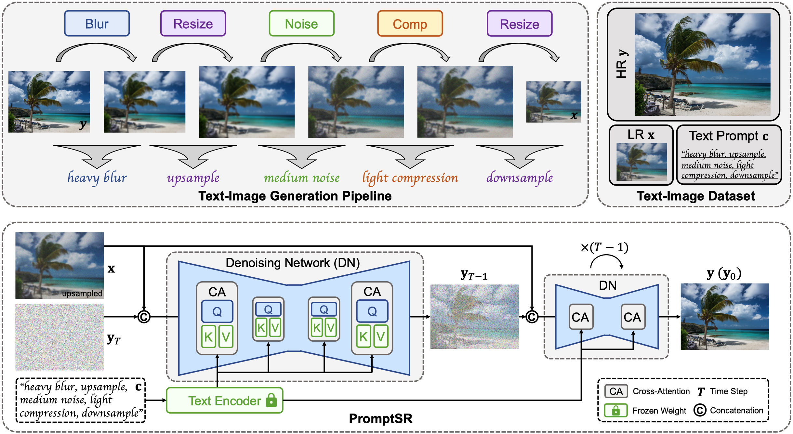

---

[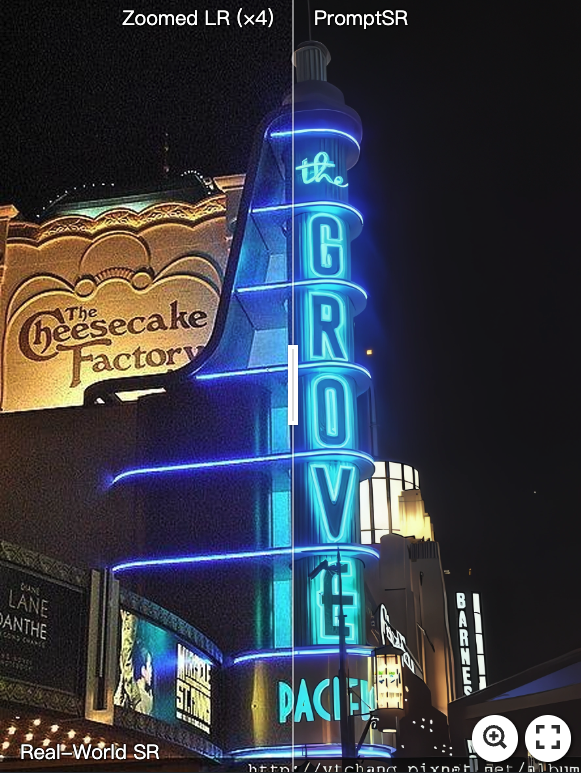](https://imgsli.com/MjIyMjk5) [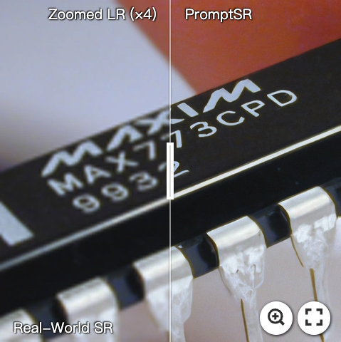](https://imgsli.com/MjIyMzAy) [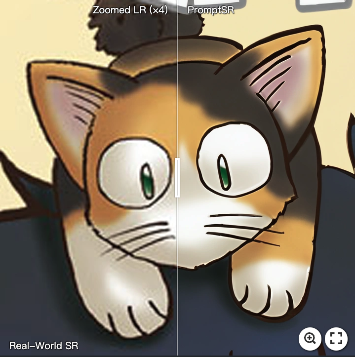](https://imgsli.com/MjIyMzEw) [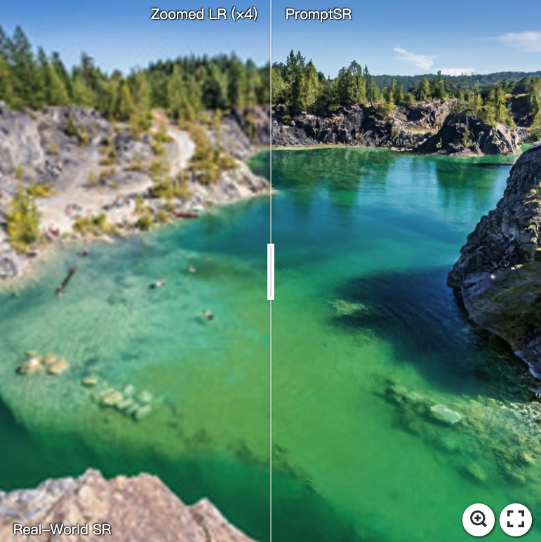](https://imgsli.com/MjIyMzA4)

[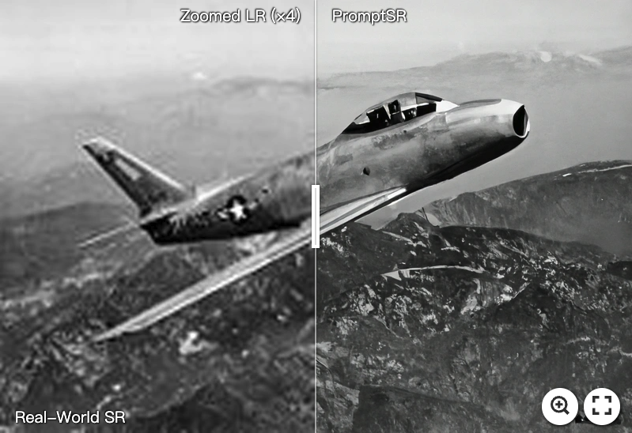](https://imgsli.com/MjIyMzA0) [](https://imgsli.com/MjIyMzAw) [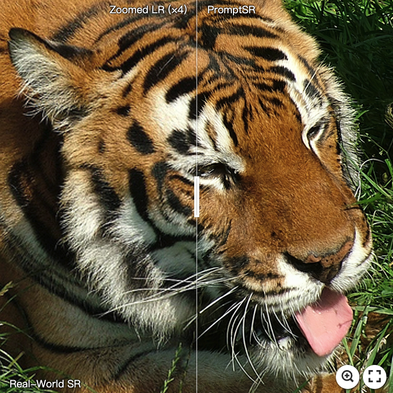](https://imgsli.com/MjIyMjk3)

---

|                      LR                      |                   Bicubic                    |             Prompt: [*Light Noise*]             |             Prompt: [*Heavy Noise*]             |
| :------------------------------------------: | :------------------------------------------: | :---------------------------------------------: | :---------------------------------------------: |
| 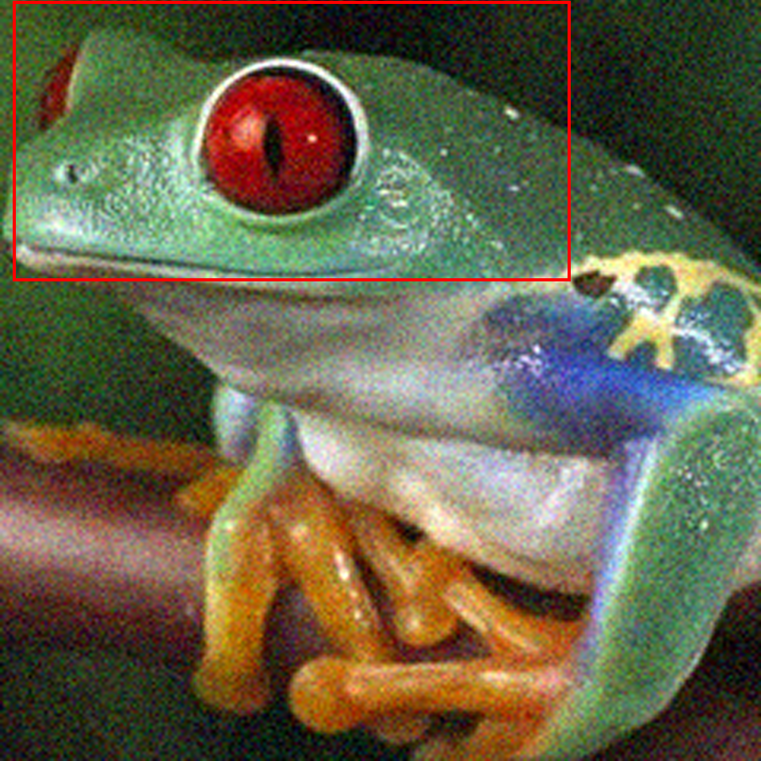 |  | 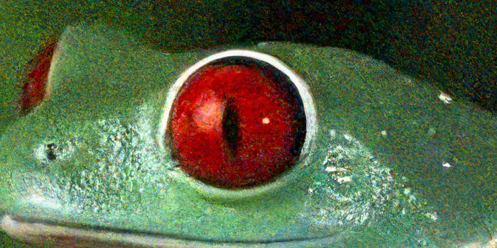 | 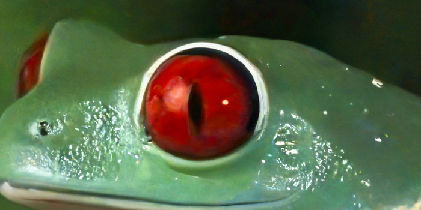 |
| 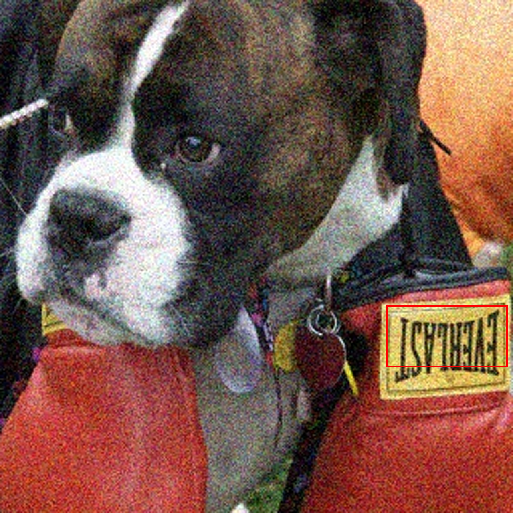  | 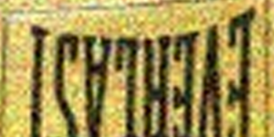  | 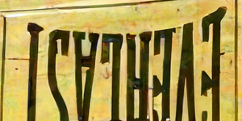  | 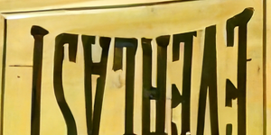  |

## ⚒️ TODO

* [ ] Release code and pretrained models

## 🔗 Contents

1. Datasets
1. Models
1. Training
1. Testing
1. [Results](#results)
1. [Citation](#citation)
1. [Acknowledgements](#acknowledgements)

## <a name="results"></a>🔎 Results

We achieved state-of-the-art performance on synthetic and real-world blur dataset. Detailed results can be found in the paper.

<details>
<summary>Evaluation on Synthetic Datasets (click to expan)</summary>


- quantitative comparisons in Table 4 of the main paper

<p align="center">
  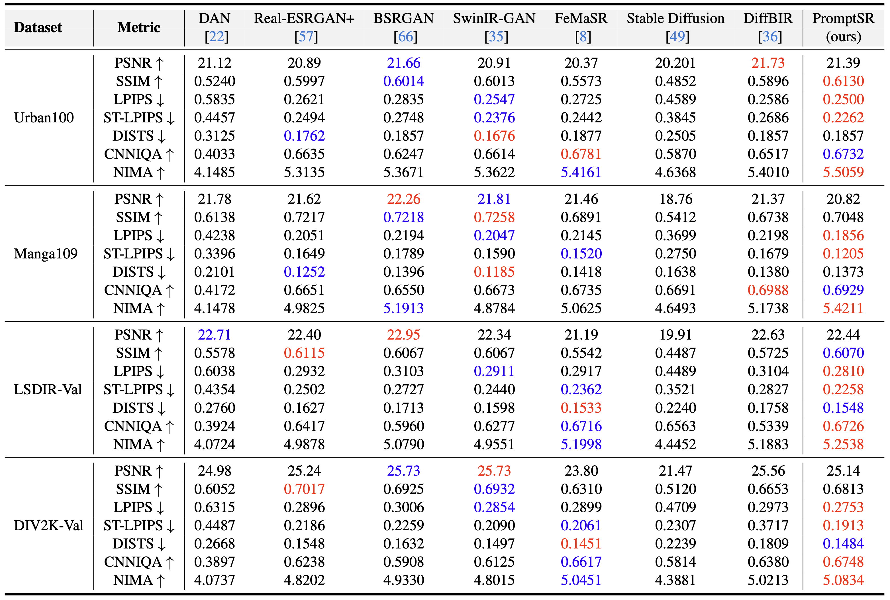
</p>


- visual comparison in Figure 5 of the main paper

<p align="center">
  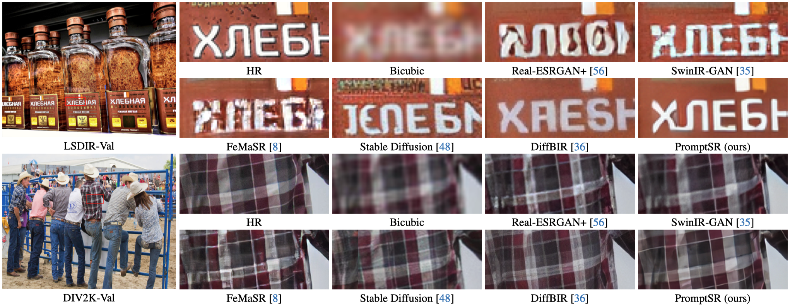
</p>
</details>

<details>
<summary>Evaluation on Real-World Datasets (click to expan)</summary>


- quantitative comparisons in Table 5 of the main paper

<p align="center">
  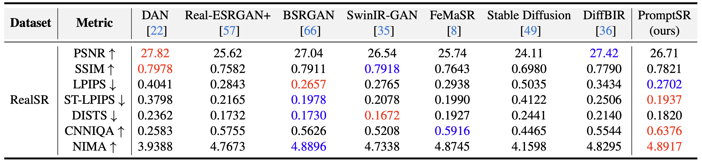
</p>


- visual comparison in Figure 6 of the main paper

<p align="center">
  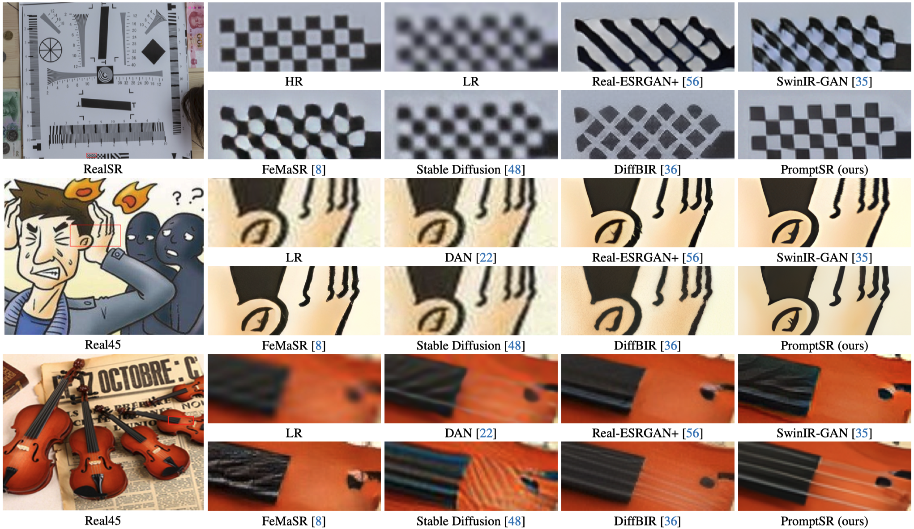
</p>

</details>

## <a name="citation"></a>📎 Citation

If you find the code helpful in your resarch or work, please cite the following paper(s).

```
@article{chen2023image,
  title={Image Super-Resolution with Text Prompt Diffusion},
  author={Chen, Zheng and Zhang, Yulun and Gu, Jinjin and Yuan, Xin and Kong, Linghe and Chen, Guihai and Yang, Xiaokang},
  journal={},
  year={2023}
}
```

## <a name="acknowledgements"></a>💡 Acknowledgements

This code is built on [BasicSR](https://github.com/XPixelGroup/BasicSR), [Image-Super-Resolution-via-Iterative-Refinement](https://github.com/Janspiry/Image-Super-Resolution-via-Iterative-Refinement).

